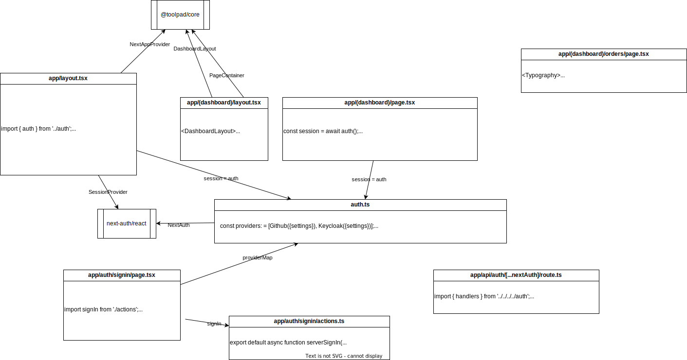

# Toolpad Demo

This is a playground for [MUI Toolpad](https://mui.com/toolpad/core/introduction/installation/#automatic-installation)

## Install

- prerequisites: node 22
- `git clone`
- `npm i` - install the dependences
- `npm init` - generate `.env.local`
- `npx auth secret` - to generate a secrect
- set the variables in `.env.local` - see the comments in that file
- `npm start` - start the app

## Technical Design

